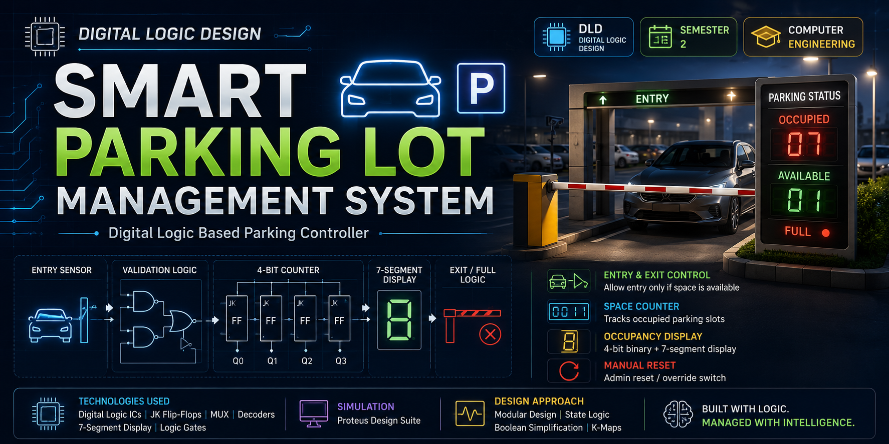
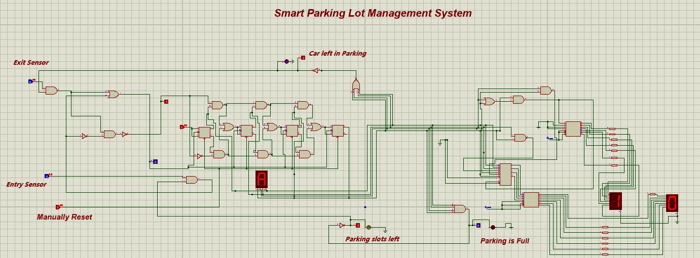

<div align="center">

# 🅿️ Smart Parking Lot Management System


A fully sequential **Smart Parking Lot Controller** built entirely from digital logic gates, JK flip-flops, a MUX, and BCD-to-7-segment decoders designed and simulated in **Proteus**.




</div>

---

## 📌 About

This project was developed as the **Semester Project (Assignment 4)** for the **Digital Logic Design** course at **Department of Computer Engineering, Bahria University Islamabad**. It automates entry/exit control and occupancy tracking for a parking lot using only combinational and sequential logic no microcontroller involved. The system monitors available spaces, blocks entry when full, blocks exit when empty, and displays live occupancy on 7-segment displays.

**Team:**
- Muhammad Shoaib
- Muhammad Ubaid
- Muhammad Ali

---

## ✨ Features

| Module | Functionality |
|---|---|
| 🚗 **Entry Control** | Entry sensor (switch) only triggers the counter if the lot isn't full; blocked automatically otherwise |
| 🚙 **Exit Control** | Exit sensor only triggers the counter if the lot isn't empty; prevents negative counts |
| 🔢 **4-bit Up/Down Counter** | Built from JK flip-flops (7473) — increments on valid entry, decrements on valid exit |
| 🔴 **Full Indicator** | Red LED lights up when occupancy hits maximum capacity |
| 🟢 **Slots-Left Indicator** | Green LED/logic shows available space status |
| 🔵 **Activity Indicator** | Blue LED signals a car is currently in the lot |
| 🔀 **MUX-Based Control** | 74157 MUX routes between sensor-driven counting and manual reset |
| 🔁 **Manual Override / Reset** | Admin switch resets the entire system to zero, overriding normal operation |
| 🖥️ **Occupancy Display** | Live count shown via 7-segment display(s), decoded through 7448 BCD-to-7-segment ICs |

---

## 🧠 How It Works

1. **Sensing** — Entry and exit sensors are simulated using SPST switches. Each acts as a "car detected" trigger at the gate.
2. **Validation Logic** — Before the counter is allowed to change, AND/OR/NOT gates check two conditions:
   - Entry is only allowed if the lot is **not full**
   - Exit is only allowed if the lot is **not empty**
3. **Counting** — A valid entry or exit produces a clock pulse that drives a **4-bit synchronous up/down counter** built from two 7473 (dual JK flip-flop) ICs.
4. **Decoding** — The 4-bit binary count (Q₃Q₂Q₁Q₀) is fed into 7448 BCD-to-7-segment decoders, converting the binary value into a human-readable digit on the 7-segment display.
5. **Status Indication** — Dedicated combinational logic continuously evaluates the counter output:
   - `FULL = Q₃·Q₂·Q₁·Q₀` → all four bits high (count = 15) → Full LED ON, entry blocked
   - `EMPTY = Q₃'·Q₂'·Q₁'·Q₀'` → all four bits low (count = 0) → exit blocked
6. **Manual Reset** — A 74157 MUX allows the admin switch to override sensor inputs and force the counter back to `0000` at any time.

---

## 🖥️ Circuit Diagram



*Full Proteus schematic — sensor logic (left), 4-bit JK flip-flop up/down counter and MUX (center), BCD-to-7-segment decoding and display stage (right).*

---

## 🧰 Components Used

<div align="center">

### 🔵 ICs

| # | Component | Part No. | Function | Qty |
|:---:|---|:---:|---|:---:|
| 1 | JK Flip-Flop (dual) | 7473 | 4-bit up/down counter | 2 |
| 2 | BCD to 7-Segment Decoder | 7448 | Converts binary count to display format | 2 |
| 3 | 4-bit 2:1 Multiplexer | 74157 | Routes sensor vs. manual-reset control | 1 |

### 🟠 Logic Gates

| Gate Type | Qty |
|:---:|:---:|
| AND | 11 |
| OR | 3 |
| NOT | 5 |
| NAND | 1 |
| AND (4-input) | 1 |
| NOR (4-input) | 1 |

### 🔴 Indicators & Display

| # | Component | Qty |
|:---:|---|:---:|
| 1 | LED — Red (Parking Full) | 1 |
| 2 | LED — Green (Slots Left) | 1 |
| 3 | LED — Blue (Car in Parking) | 1 |
| 4 | 7-Segment Display (Occupancy Count) | Multiple |
| 5 | Resistor — 330Ω (current limiting) | 14 |

### ⚙️ Input / Control

| # | Component | Role |
|:---:|---|---|
| 1 | Switch | Entry Sensor |
| 2 | Switch | Exit Sensor |
| 3 | Switch | Manual Reset (Admin Override) |

</div>

---

## 📐 Design Details

### Entry Control Logic

| Entry Sensor | Parking Full | Allow Entry | Entry Gate Signal |
|:---:|:---:|:---:|:---:|
| 0 | X | 0 | 0 |
| 1 | 0 | 1 | 1 |
| 1 | 1 | 0 | 0 |

### Exit Control Logic

| Exit Sensor | Parking Empty | Allow Exit | Exit Gate Signal |
|:---:|:---:|:---:|:---:|
| 0 | X | 0 | 0 |
| 1 | 0 | 1 | 1 |
| 1 | 1 | 0 | 0 |

### JK Flip-Flop Excitation Rule

| Current (Qₙ) | Next (Qₙ₊₁) | Jₙ | Kₙ |
|:---:|:---:|:---:|:---:|
| 0 | 0 | 0 | X |
| 0 | 1 | 1 | X |
| 1 | 0 | X | 1 |
| 1 | 1 | X | 0 |

### 4-Bit Up Counter — Full Excitation Table

| Current (Q₃Q₂Q₁Q₀) | Next (UP) | J₃ | K₃ | J₂ | K₂ | J₁ | K₁ | J₀ | K₀ |
|:---:|:---:|:---:|:---:|:---:|:---:|:---:|:---:|:---:|:---:|
| 0000 | 0001 | 0 | X | 0 | X | 0 | X | 1 | X |
| 0001 | 0010 | 0 | X | 0 | X | 1 | X | X | 1 |
| 0010 | 0011 | 0 | X | 0 | X | X | 0 | 1 | X |
| 0011 | 0100 | 0 | X | 1 | X | X | 1 | X | 1 |
| 0100 | 0101 | 0 | X | X | 0 | 0 | X | 1 | X |
| 0101 | 0110 | 0 | X | X | 0 | 1 | X | X | 1 |
| 0110 | 0111 | 0 | X | X | 0 | X | 0 | 1 | X |
| 0111 | 1000 | 1 | X | X | 1 | X | 1 | X | 1 |
| 1000 | 1001 | X | 0 | 0 | X | 0 | X | 1 | X |
| 1001 | 1010 | X | 0 | 0 | X | 1 | X | X | 1 |
| 1010 | 1011 | X | 0 | 0 | X | X | 0 | 1 | X |
| 1011 | 1100 | X | 0 | 1 | X | X | 1 | X | 1 |
| 1100 | 1101 | X | 0 | X | 0 | 0 | X | 1 | X |
| 1101 | 1110 | X | 0 | X | 0 | 1 | X | X | 1 |
| 1110 | 1111 | X | 0 | X | 0 | X | 0 | 1 | X |
| 1111 | 1111 | X | 0 | X | 0 | X | 0 | X | 0 |

> Counter holds at `1111` when counting up and at `0000` when counting down — no rollover.

### K-Map Simplified Expressions

**Full Detection:**
```
FULL = Q₃ · Q₂ · Q₁ · Q₀        (asserted at binary 1111 = decimal 15)
```

**Empty Detection:**
```
EMPTY = Q₃' · Q₂' · Q₁' · Q₀'   (asserted at binary 0000 = decimal 0)
```

**Counter Toggle Conditions (Up):**

| Flip-Flop | Toggles When |
|---|---|
| Q₀ | Every valid clock pulse |
| Q₁ | Q₀ = 1 |
| Q₂ | Q₁ = 1 and Q₀ = 1 |
| Q₃ | Q₂ = 1, Q₁ = 1, and Q₀ = 1 |

---

## 🛠️ Tech Stack


- **Simulation Tool:** Proteus Design Suite
- **Concepts:** Sequential Logic Design · JK Flip-Flop Counters · K-Map Simplification · BCD Decoding · Multiplexer-Based Control Routing · Combinational Boolean Logic

---

## 📁 Project Structure

```
Smart-Parking-Lot-Management-System/
├── 📄 README.md
├── 📄 Smart_Parking_Lot.pdsprj              # Proteus project file
├── 📁 docs/
│   ├── 📄 Design_Report.pdf                 # Full report: block diagram, truth tables, K-maps
│   ├── 📄 Circuit_Schematic.pdf             # Circuit schematic (PDF export)
│   └── 📄 Assignment_Requirements.pdf        # Original assignment brief
└── 📁 images/
    └── 🖼️ Circuit_Screenshot..jpeg          # Full circuit screenshot
```

---

## 🚀 Run Locally

**1. Clone the repository**
```bash
git clone https://github.com/muhammadshoaib-ce/Smart-Parking-Lot-Management-System.git
```

**2. Open in Proteus**
```
File → Open Project → Smart_Parking_Lot.pdsprj
```

**3. Run the simulation**
```
Click the "Play" button at the bottom-left of the Proteus window
```

**4. Interact with the circuit**
- Toggle the **Entry Sensor** switch to simulate a car entering
- Toggle the **Exit Sensor** switch to simulate a car leaving
- Watch the 7-segment display update the occupancy count in real time
- Toggle **Manually Reset** to reset the counter to zero at any point
- Try filling the lot to capacity (count = 15) to see the **Full** LED and entry block trigger

---

## 📚 Lessons Learned

- ✅ Designing a fully sequential system using only JK flip-flops and combinational logic — no microcontroller
- ✅ Deriving JK excitation tables and simplifying next-state logic with K-maps
- ✅ Using MUX-based control routing to merge sensor-driven and manual-override logic paths
- ✅ Interfacing binary counters with BCD-to-7-segment decoders for human-readable output
- ✅ Preventing invalid states (overflow/underflow) purely through gate-level guard logic
- ✅ Debugging a large multi-stage schematic and validating counter transitions state-by-state

---

## 🌱 Future Enhancements

- 🔹 Extend to multi-level parking with independent counters per floor
- 🔹 Add a timer-based billing/duration display
- 🔹 Replace manual switches with real IR/ultrasonic sensor modules on hardware
- 🔹 Migrate the control logic to Verilog/FPGA for a synthesizable version
- 🔹 Add a buzzer alert alongside the Full LED

---

## 👥 Authors

- **Muhammad Shoaib**  
  [](https://github.com/muhammadshoaib-ce)

- **Muhammad Ubaid**  
  [](https://github.com/muhammadubaid957)

- **Muhammad Ali**

*Department of Computer Engineering, Bahria University Islamabad*

---

<div align="center">

⭐ **Star this repo if you found it helpful!**

</div>
